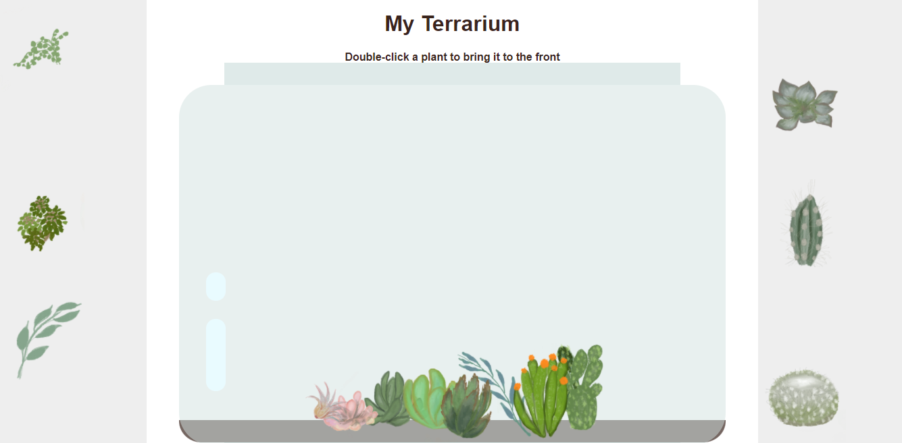

# My Terrarium: A project to learn about HTML, CSS, and DOM manipulation using JavaScript 🌵🌱

A small drag and drop code-meditation. With a little HTML, JS and CSS, you can build a web interface, style it, and add an interaction.

You can click and drag a plant to whatever place you like and organize to build your terrarium. Double-clicking a plant that is behind another one can bring it to the front.

## Lesson

[My Terrarium: A project to learn about HTML, CSS, and DOM manipulation using JavaScript](https://github.com/microsoft/Web-Dev-For-Beginners/tree/main/3-terrarium)

## Credits

Written with ♥️ by [Jen Looper](https://www.twitter.com/jenlooper)

The terrarium created via CSS was inspired by Jakub Mandra's glass jar [codepen](https://codepen.io/Rotarepmi/pen/rjpNZY).

The artwork was hand drawn by [Jen Looper](http://jenlooper.com) using Procreate.

The challenges of the lessons were concluded by [William Firmino](https://https://github.com/Willwf).
