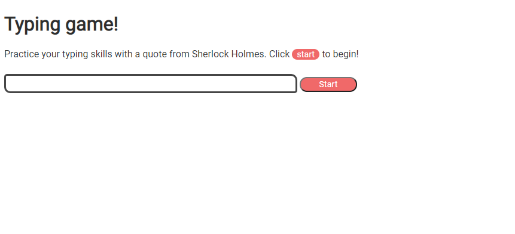
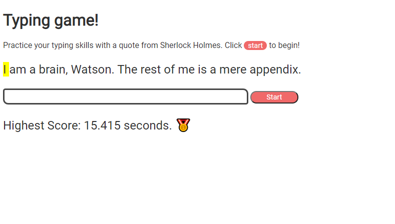
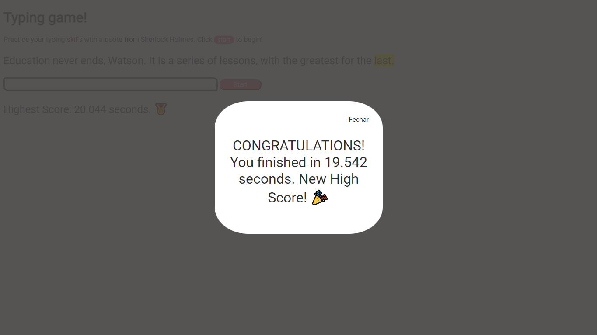

# Event-Driven Programming - Build a Typing Game

## Introduction

Typing is one of the most underrated skills of the developer. The ability to quickly transfer thoughts from your head to your editor allows creativity to flow freely. One of the best ways to learn is to play a game!

> So, let's build a typing game!

The game will present the player with a random quote (we're using [Sherlock Holmes](https://en.wikipedia.org/wiki/Sherlock_Holmes) quotes) and time how long the player takes to type it out accurately.

> Front page of the game:
> 

> Quote displayed when the button start is clicked:
> 

The word that must be typed is highlighted in yellow. The fastest score is storaged on the browser.

> Modal displayed when you have typed out the entire quote correctly:
> 
> The message "New High Score! 🎉" is only showed if you have typed out faster than the last score storaged on the browser.

## Lesson

[Creating a typing game by using event driven programming](https://github.com/microsoft/Web-Dev-For-Beginners/blob/main/4-typing-game/README.md)

## Credits

Written with ♥️ by [Christopher Harrison](http://www.twitter.com/geektrainer)

Styling and functionalities of the challenges added by [William Firmino](https://https://github.com/Willwf).
